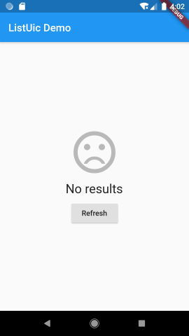
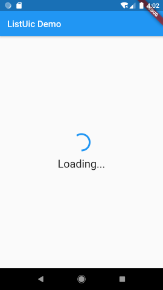
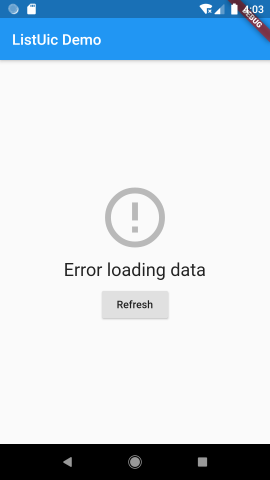
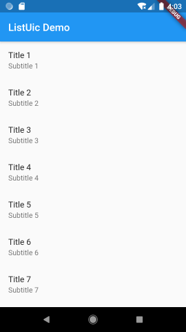

# uic

## UIC (UI Components)

A set of Flutter widgets that simplifies implementing most used UI cases.

Currently includes the following UI components:
- `ListUic` - Wrapper of **ListView**, which implements related data loading and state management logic.
- `ProgressUic` - Wrapper of **ProgressIndicator** with additional text.

### ListUic

Almost each app has screens that display a list of items. Simple task at first look, but often it requires much related staff to be implemented. Progress indicator while data for the list is loading, separate views for empty data, error loading data, etc. All those boilerplate can be simplified with **ListUic** widget.

&nbsp;&nbsp;&nbsp;

## Usage

In the `dependencies:` section of your `pubspec.yaml`, add the following line:

```yaml
dependencies:
  uic: ^0.1.0
```

### ListUic

Import the package

```dart
import 'package:uic/list_uic.dart';
```

Add `ListUicController` to your page's state:

<pre><code>
class _MyHomePageState extends State&lt;MyHomePage&gt; {

  <b>ListUicController&lt;int&gt; _controller;</b>
  ...
  
  @override
  void initState() {
    super.initState();
    <b>_controller = ListUicController&lt;int&gt;(
      onGetItems: (int page) => _getItems(page),
    );</b>
    ...
  }
  ...
}
</code></pre>

Add `ListUic` widget to your widget tree:

<pre><code>
  @override
  Widget build(BuildContext context) {
    return Scaffold(
      appBar: AppBar(
        title: Text(widget.title),
      ),
      body: <b>ListUic&lt;int&gt;(
        controller: _controller,
        itemBuilder: (item) {
          return ListTile(
            title: Text('Title ${item}'),
            subtitle: Text('Subtitle ${item}'),
          );
        },
      ),</b>
    );
  }
</code></pre>

Implement a function that will return a list of items:

<pre><code>
  Future&lt;List&lt;int&gt;&gt; _getItems(int page) async {
    ...
  }
</code></pre>

Read the docs for available customization options.

Also you can check [demo app](https://github.com/ech89899/uic-flutter/tree/master/example) for details of using `ListUic` widget.